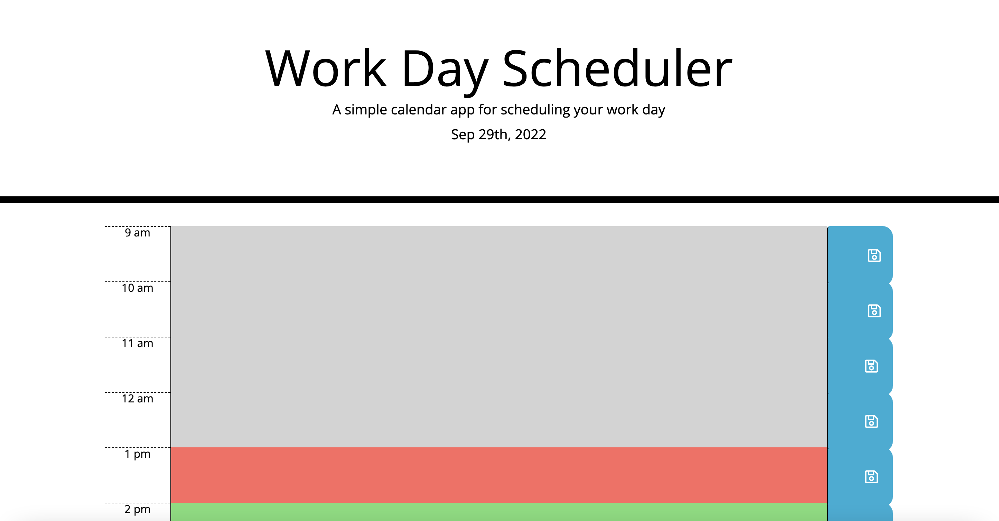

# Work-Day-Scheduler

## Description

As an employee with a busy schedule I want to add important events to a daily planner to that my time can be managed effectively.

I am using a daily planner to create a schedule. When the planner is opened the current day is displayed a the top of the calendar. When scrolling down time blocks for standard business hours are presented. 

When viewing the time blocks for that day, each time block is color-coded to indicate whether it is in the past, present, or future. You can enter an event by clicking into a time bock. Text for that event is saved in local storage by clicking the save button for that time block. When I refresh the page the saved events persist. 

HTML, CSS and Java Script were used in the creation of this planner. 

Third party APIs used: Moment and JQuery.

## Usage

To use the Work-Day-Scheduler go to https://janellecikanek.github.io/Work-Day-Scheduler/.

 
   

## License

Please refer to the LICENSE in the repo.
